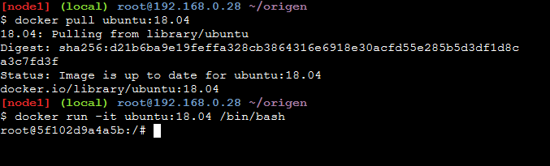
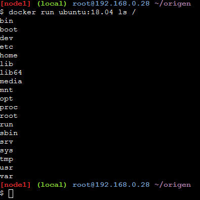
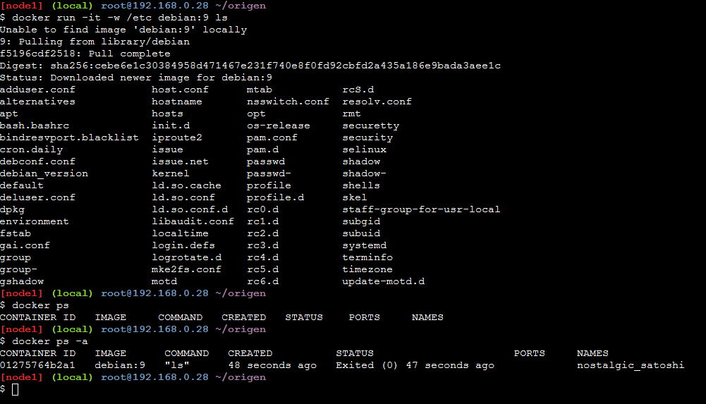

# Ejecutando contenedores. Ejemplo 1, Ejemplo 2 y Ejemplo 4 de los apuntes.

Con el objetivo de trabajar utilizando Docker, vamos a realizar los ejemplos 1, 2 y 4 de los apuntes proporcionados.

### Ejemplo 1

En este ejemplo, descargamos una imagen de **ubuntu:18.04** y, posteriormente, creamos un contenedor del mismo. Con los comandos mostrados en la imagen, hay que destacar principalmente tres detalles:

1. Al haber descargado una imagen de manera previa, no se descarga cuando creamos el contenedor.
2. Al crear el documento, se nos da acceso a un *shell* del mencionado.
3. Estamos accediendo al *shell* como `root`, por lo que hay que actuar con precaución cuando manipulemos los ficheros del sistema.

Se puede salir del contenedor igual que en cualquier terminal de *bash* (usando `exit`). Al hacerlo, tendríamos que crear un nuevo contenedor.

---
### Ejemplo 2

En este ejemplo, creamos un contenedor de **ubuntu:18.04** y listamos el contenido que se encuentra en la carpeta `/`. Como ya habíamos descargado la imagen previamente en el [ejemplo 1](#id1), no nos hace falta descargarla otra vez, pero hay que recordar que si no lo hacemos se descargará a la vez que creamos el contenedor. Otro aspecto que los diferencia es que, en vez de darte acceso a un *shell* del contenedor, directamente ejecuta el comando `ls /`, que muestra el contenido de la carpeta. Cuando termina de ejecutarse el comando, salimos automáticamente del contenedor, lo que nos impide volver a acceder al mismo.

Dicho de otro modo, este ejemplo nos muestra el resultado que habríamos observado en el [ejemplo 1](#id1) si hubiésemos introducido en la terminal `ls /` y `exit`.

---
### Ejemplo 4

En este ejemplo creamos un contenedor de **debian:9** y mostramos el contenido de una de las carpetas encontradas en su interior, en este caso `/etc`. En este ejemplo podemos ver todo lo que hemos explicado tanto en el [ejemplo 1](#id1) como en el [ejemplo 2](#id2):

* Al crear el contenedor, se ha descargado la imagen simultáneamente.
* Al ejecutarse el comando, salimos automáticamente del contenedor.

En este caso, de forma adicional, hemos introducido dos comandos adicionales que, aunque no tengan que ver con la propia ejecución de los contenedores, son de gran ayuda para consultar todos nuestros contenedores en el sistema.

- El primer comando, `docker ps`, muestra los contenedores que estén activos en el momento.
- El segundo comando, `docker ps -a`, muestra todos los contenedores, tanto los activos como los parados. En este ejemplo podemos ver que tenemos el contenedor de **debian:9** que hemos usado recientemente.
